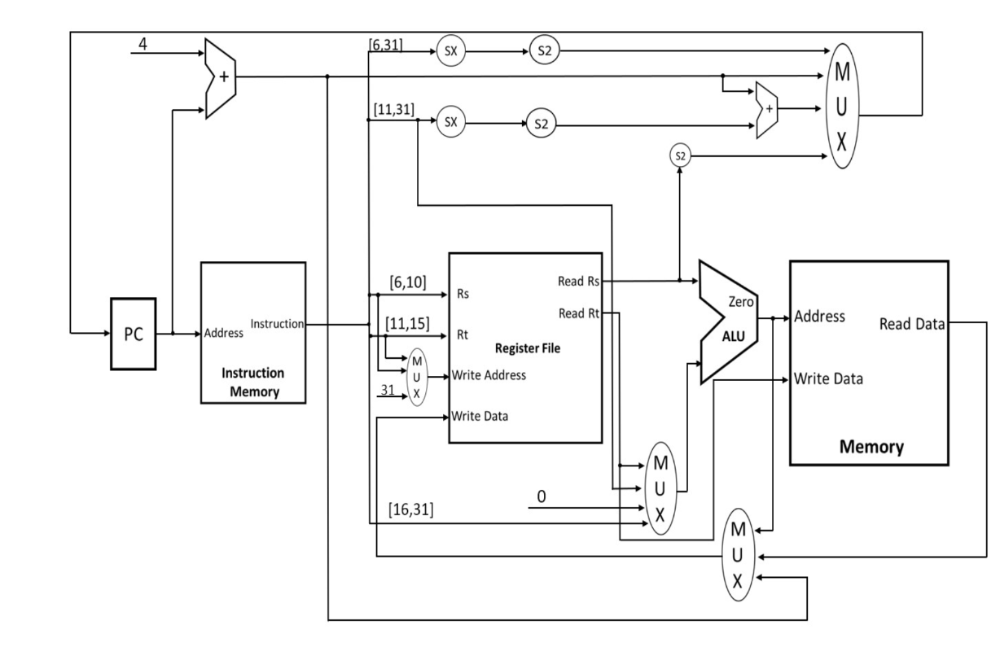

# KGP_RISC

### Design/Diagram:

### Languages:
-   verilog

### Design modules:
-   miniRISC.v (top module)
-   ALU.v (alu)
-   ProgramCounter.v (PC)
-   InstructionFetch.v (IF)
-   decoder.v (decoder)
-   ControlUnit.v (CU)
-   registerFile.v (RF)
-   MemoryFetch.v (MF)
-   Clock_divider.v (CD)
-   Four different MUX
-   Two memory element (BRAM):instruction fetch, memory fetch

### INSTRUCTIONS:
-   refer to data/KGP_RISC.pdf

### Contributors
-   Akash Das (20CS10006)
-   Suhas AM (20CS10066)
